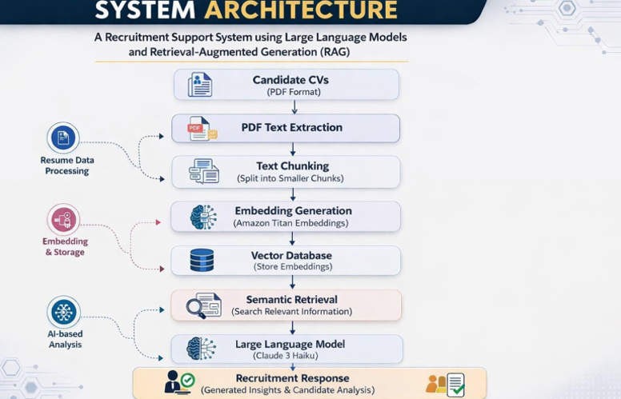
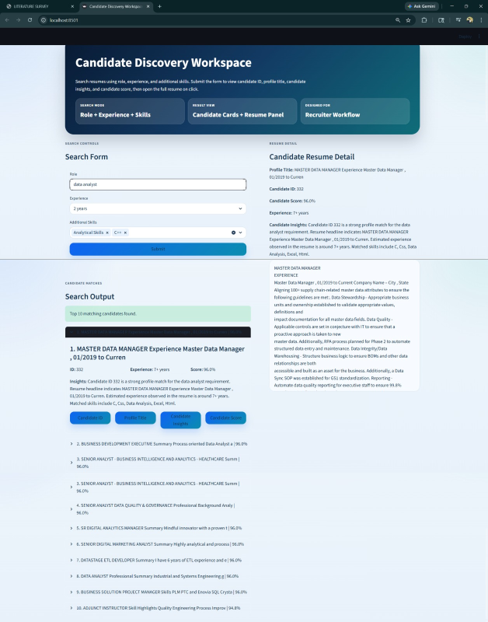
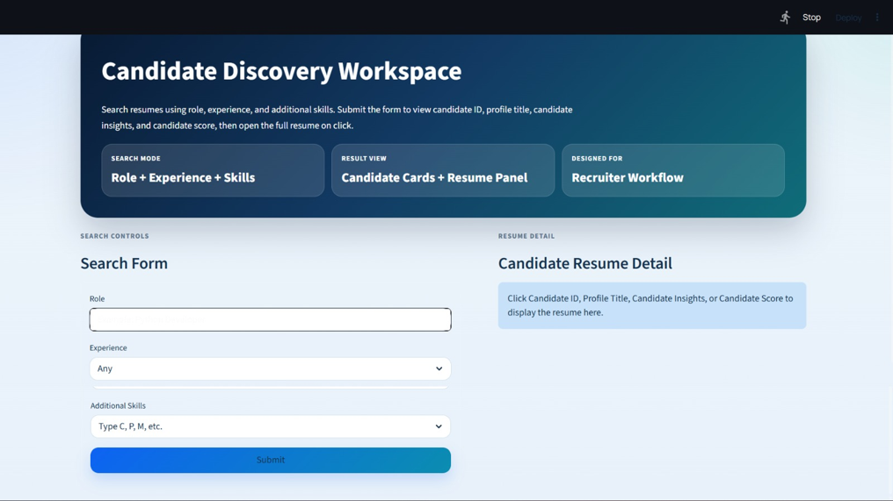

\# AI Recruitment Support System using LLM and RAG


\## Project Overview


The AI Recruitment Support System is an intelligent hiring assistance platform that automates resume processing, candidate retrieval, semantic search, and candidate ranking using Artificial Intelligence, Large Language Models (LLMs), and Retrieval-Augmented Generation (RAG).


The system helps recruiters efficiently identify suitable candidates by analyzing resume content, generating semantic embeddings, performing similarity-based retrieval, and producing AI-powered candidate insights.


\---
## Project Screenshots

### System Architecture



### Candidate Search Interface



### Dashboard




\## Key Features


\* Resume Upload and Processing

\* Resume Text Extraction and Parsing

\* Semantic Search using Vector Embeddings

\* Candidate Retrieval and Ranking

\* Retrieval-Augmented Generation (RAG)

\* AI-Based Candidate Insights

\* FastAPI Backend Services

\* Streamlit Interactive User Interface

\* SQLite Database Integration

\* ChromaDB Vector Database Support

\* Dashboard and Analytics Support


\---


\## System Architecture


The system follows a Retrieval-Augmented Generation (RAG) architecture:


1\. Candidate resumes are uploaded and processed.

2\. Resume text is extracted and cleaned.

3\. Text is converted into vector embeddings.

4\. Embeddings are stored in a vector database.

5\. Recruiter queries are converted into embeddings.

6\. Semantic search retrieves relevant candidate profiles.

7\. Retrieved candidates are ranked based on relevance.

8\. Large Language Models generate intelligent recruitment insights.


\---


\## Technologies Used


\### Programming Language


\* Python 3.11


\### Backend


\* FastAPI

\* Uvicorn


\### Frontend


\* Streamlit


\### Database


\* SQLite


\### Vector Database


\* ChromaDB


\### AI / NLP Libraries


\* Sentence Transformers

\* Transformers

\* OpenAI / Ollama (Optional)


\### Data Processing


\* Pandas

\* NumPy

\* pdfplumber


\---


\## Project Structure


```text

backend/

frontend/

dataset/

scripts/


requirements.txt

run\_project.ps1

```


\---


\## Algorithms Used


\* Resume Parsing Algorithm

\* Text Preprocessing Algorithm

\* Embedding Generation Algorithm

\* Semantic Similarity Matching

\* Candidate Retrieval Algorithm

\* Candidate Ranking Algorithm

\* RAG-Based Retrieval

\* LLM-Based Response Generation


\---


\## Modules Implemented


\* Resume Processing Module

\* Embedding Generation Module

\* Vector Database Module

\* Candidate Retrieval Module

\* Ranking Module

\* RAG Module

\* LLM Module

\* Dashboard Module

\* Backend API Module

\* Frontend User Interface Module


\---


\## Proposed Methodology


The system converts resumes into vector embeddings and stores them in a vector database. Recruiter queries are transformed into embeddings and compared using semantic similarity techniques. Relevant candidate profiles are retrieved, ranked, and analyzed through a Retrieval-Augmented Generation pipeline to provide accurate and context-aware recruitment recommendations.


\---


\## Future Scope


\* Advanced Candidate Ranking Models

\* Enhanced Semantic Matching Techniques

\* Real-Time Analytics Dashboard

\* Cloud-Based Deployment

\* Multi-Modal Resume Analysis

\* Video Interview Assessment Integration


\---


\## Conclusion


The project demonstrates the application of Large Language Models, Retrieval-Augmented Generation, Semantic Search, and Vector Databases in recruitment automation. It provides an intelligent, scalable, and efficient solution for candidate discovery, evaluation, and recruitment decision support.


\---


\## Author


\*\*Gagan Venkat\*\*


GitHub: https://github.com/gaganvenkat99


